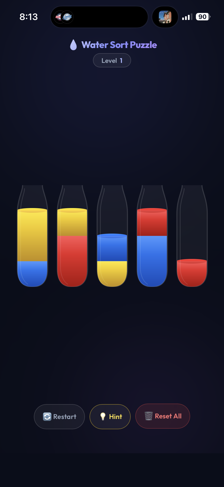
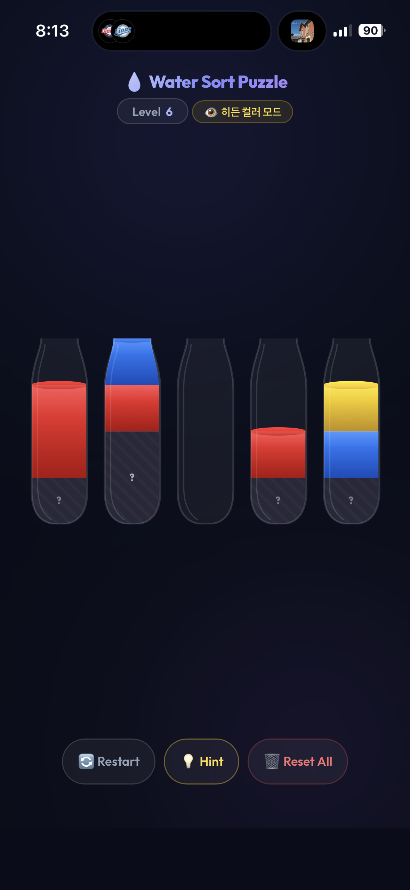
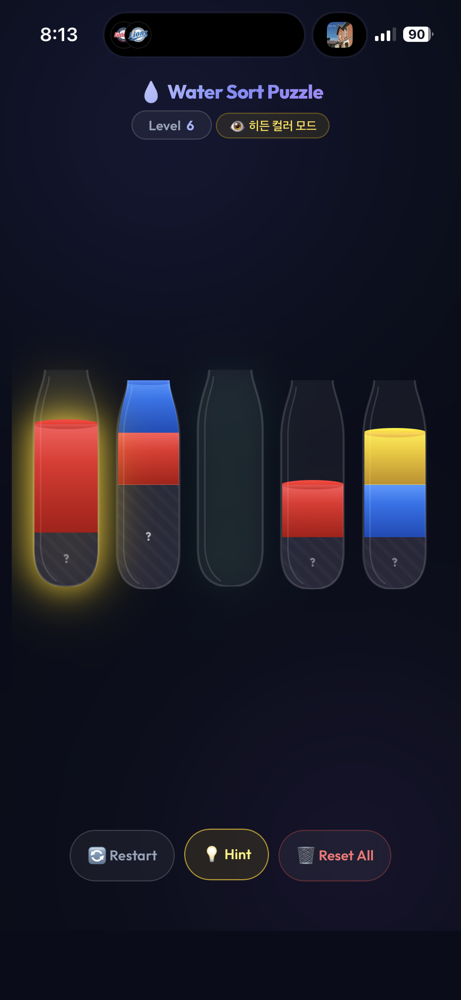

# 1. Water Sort Puzzle

순수 HTML/CSS/JS 한 파일로 동작하는 워터 소트 퍼즐 게임
서버 없이 `index.html` 파일 하나만 있으면 어디서든 실행 가능

---

## 스크린샷

  
  
  

---

## 게임 방법

1. 유리병을 탭해 선택
2. 다른 유리병을 탭하면 맨 위 색상의 물이 흘러감
3. 같은 색끼리만 합칠 수 있고, 빈 병에는 아무 색이나 부을 수 있음
4. 모든 병이 단색으로 가득 채워지면 클리어!

---

## 주요 기능

| 기능 | 설명 |
|------|------|
| 8색 팔레트 | 빨강·파랑·노랑·초록·주황·보라·시안·핑크 — 최대 대비 색상 조합 |
| 파동 난이도 | 레벨이 오를수록 단조롭게 어려워지지 않고 어렵다↔쉽다를 반복 |
| 히든 컬러 | 6레벨부터 하단 레이어가 `?`로 가려짐. 물을 따르는 순간 색상 공개 |
| 무제한 힌트 | 유효한 이동 쌍을 황금/에메랄드 빛으로 강조. 막힌 상태는 안내 토스트 표시 |
| 동시 애니메이션 | 서로 다른 병은 동시에 조작 가능 (전역 잠금 없음) |
| Web Audio 효과음 | 선택·붓기·방울·클리어 사운드 |
| 자동 저장 | 브라우저를 닫아도 레벨 진행이 유지됨 |

---

## 레벨 구조

| 구간 | 색상 수 | 특징 |
|------|---------|------|
| 1 – 5 | 3 – 4색 | 튜토리얼 구간, 히든 없음 |
| 6 – 9 | 4 – 6색 | 히든 컬러 1레이어 활성화 |
| 10 – 14 | 5 – 7색 | 히든 컬러 2레이어 |
| 15+ | 6 – 8색 | 히든 컬러 3레이어, 최고 난이도 |

---
